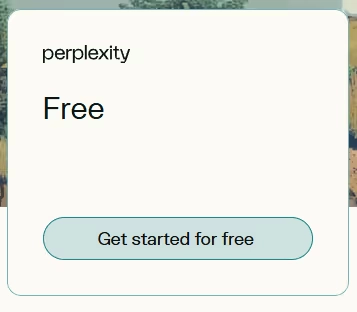
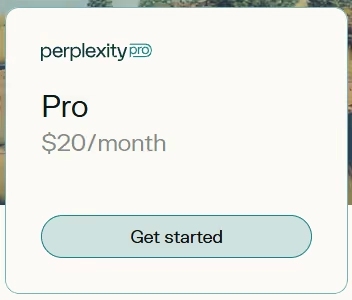
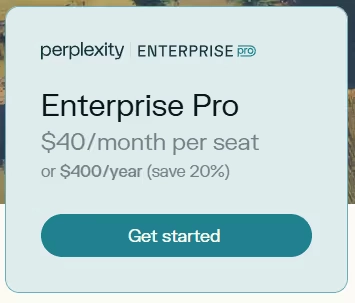
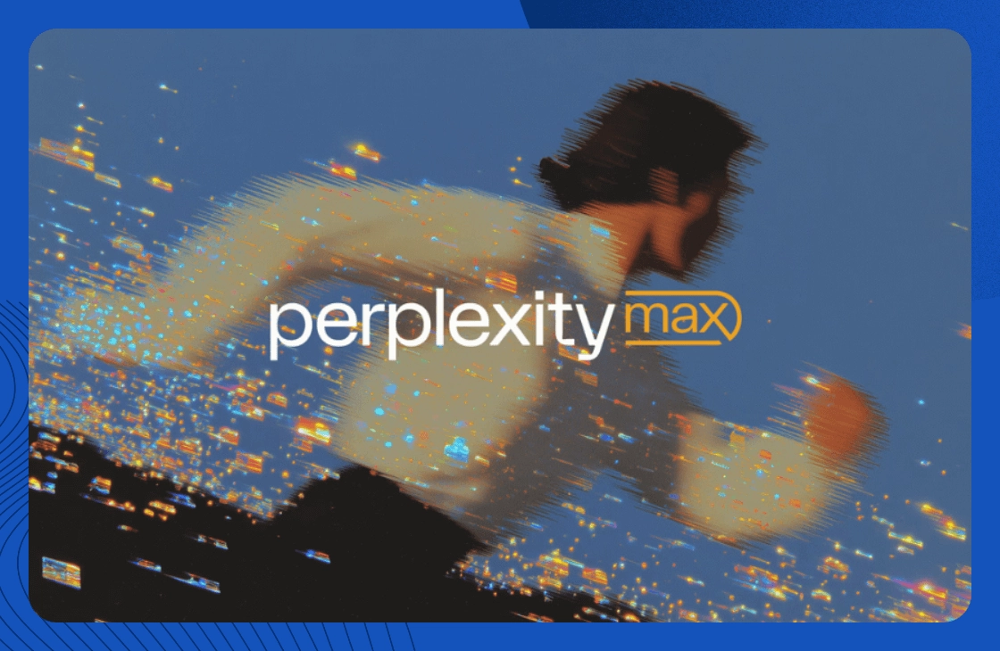

# Perplexity 2025年定价全解析：免费版够用吗?Pro版值不值?

---

你可能也有过这种体验:打开搜索引擎,翻了三页结果还没找到想要的答案。Perplexity 的出现就是为了解决这个问题——它把搜索和AI对话结合起来,直接给你答案,而不是一堆链接。

问题来了:免费版够用吗?Pro版20美元一个月到底买的是什么?企业版适合谁?这篇文章把Perplexity所有付费方案拆开来看,帮你搞清楚哪个最适合你。

---

## Perplexity 到底怎么收费?

### 免费版(Standard):零成本试水

**每月费用:** 0元

免费版让你无限次使用快速搜索模式,还能每天试用3次Pro级别的高级模型(比如GPT-4.1和Claude 4.0)。想体验一下Perplexity能干什么,免费版就够了。

**具体包括:**
- Quick Mode无限次使用,实时给答案
- 每天3次Pro搜索,可以调用GPT-4这类高级模型
- 可以上传文件问问题
- 每4小时最多5个追问
- 保存搜索历史、收藏内容,手机电脑都能用

### Pro版:20美元/月买什么?

**费用:** 20美元/月,或者200美元/年(每月送5美元API额度)

Pro版适合每天都要用AI工具的人。你不再受限于"每天3次",想问多少问多少。

**具体包括:**
- 随便用GPT-4.1、Claude 4.0 Sonnet、Mistral这些顶级模型
- Pro搜索无限次
- 文件上传不限数量,PDF、CSV、音视频、图片都行,还自动转录
- AI生成图片(用的是DALL·E 3和SDXL)
- "Copilot"交互助手模式
- 没广告,响应更快
- 每月5美元API额度给开发者玩

说实话,如果你只是偶尔搜点东西,免费版够了。但如果你每天都在研究问题、处理文档、生成内容,Pro版的无限次使用就很值。对比其他AI工具的订阅价格,👉 [Perplexity Pro年费成品号比自己单独订阅划算多了,24小时自动发货还有365天质保](https://shaoyumi.com/buy/64)——尤其是需要长期使用的人。

### 企业版(Enterprise Pro):团队协作方案

**每人费用:** 40美元/月,或者400美元/年

企业版就是Pro版的团队升级款。公司用的话,除了Pro的所有功能,还多了管理员控制面板、团队共享空间、数据安全保障。

**具体包括:**
- Pro版的所有功能:GPT-4、Claude、文件上传、Pro搜索
- Team Spaces,团队共享文件和链接搜索
- 集中管理后台和账单
- SOC 2 Type II合规认证,数据安全级别更高
- 每人每月5美元API额度
- 企业优先支持

### 开发者API怎么收费?

Pro用户每月自带5美元API额度。超出部分按用量计费:轻量模型大概每次请求0.002美元,高级模型大概每1000个token收0.015美元。

用量可以在账户后台实时查看。对开发者来说,这个价格算公道,而且计费透明。5美元的赠送额度覆盖日常轻度使用没问题。

### Max版:200美元/月的顶配

**费用:** 200美元/月,或者2000美元/年

Max版是个人用户能买到的最高配置,适合每天把Perplexity用到极限的人。你能第一时间用上OpenAI和Anthropic发布的最新模型,使用限制基本没有。

**具体包括:**
- 新模型一发布就能用
- 每天搜索次数没有固定上限
- Copilot功能增强,理解上下文更深
- API和应用内响应速度优先处理
- Pro版的所有功能:文件上传、AI生图、无限追问

## 为什么Perplexity按用量收费?

简单说,就是AI服务的成本是浮动的。

你每问一个问题,Perplexity后台就要调用大语言模型计算,这是要花钱的。重度用户成本高,轻度用户成本低。如果统一按固定价格收费,要么重度用户占便宜,要么轻度用户被坑。

按用量收费的好处:
- **成本和定价对齐:** 用得多付得多,用得少付得少,公平
- **不按人头算:** AI服务的价值不在于有多少人用,而在于用了多少次
- **应对用量波动:** 你这个月突然查了很多次,不用担心超限,也不用提前升级套餐

所以Perplexity的API部分是按token和请求计费的,而订阅套餐给你每天的查询额度。这种混合模式现在AI产品里很常见。

## Perplexity怎么搭建计费系统的?

Perplexity没有自己从零开发计费系统,而是直接用了**Orb**这个专门做用量计费的平台。

Orb在2023年就开始给Perplexity提供服务了。这意味着Perplexity从一开始推付费版,就能快速调整定价策略,不用每次改价格都让工程师重写代码。

比如后来加的Max套餐,或者API额度规则的变化,都是在Orb后台配置就能上线。这种灵活性对产品迭代很重要。

## 常见问题

**Perplexity API免费吗?**
不免费。付费套餐每月送5美元API额度,用完了按token和请求计费。

**Perplexity必须付费才能用吗?**
不是。免费版可以一直用,但每天只有3次Pro搜索和少量追问。想用GPT-4、生成图片、无限次搜索,就得付费。

**Perplexity App多少钱?**
Pro版20美元/月或200美元/年,企业版40美元/人/月。免费版一直免费,但功能有限。API用量单独计费。

**Perplexity能生成图片吗?**
能,用的是DALL·E 3和Stable Diffusion,但只有Pro和企业版能用。免费版不行。

---

## 结语

Perplexity的定价思路很清晰:免费版让你试水,Pro版解锁日常重度使用,企业版给团队加管理工具,Max版满足极端需求。API部分按用量收费,透明公平。

如果你是个人用户,每天都要查资料、处理文档、生成内容,👉 [直接买Perplexity Pro年费成品号最省事,24小时自动发货,365天质保,比零散订阅划算](https://shaoyumi.com/buy/64)。如果只是偶尔用用,免费版完全够。

AI工具的定价会越来越灵活,核心逻辑就是:你用多少,付多少。Perplexity算是把这套玩法做得比较清楚的一个。
